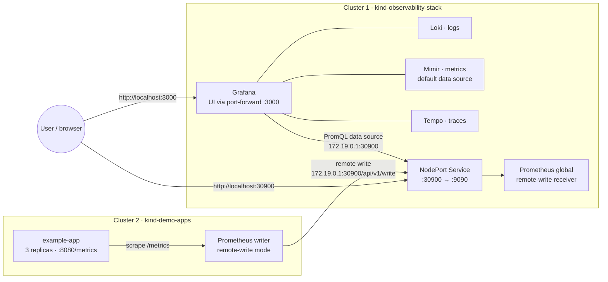
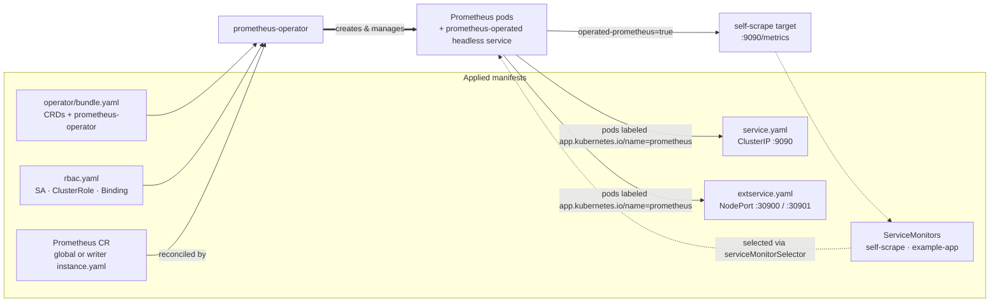

# Architecture

The stack runs two local Kind clusters on a single UNIX host. The observability cluster
(`kind-observability-stack`) hosts the Grafana LGTM stack and the global Prometheus instance;
the apps cluster (`kind-demo-apps`) hosts a Prometheus instance in remote-write mode plus an
instrumented example app. The Kind host is reachable from every cluster at `172.19.0.1`.

## Component diagram

Operators, RBAC, and ServiceMonitor wiring are omitted here for clarity — see the resource
diagram below.

## Kubernetes resource relationships (per cluster)

Both clusters apply the same set of manifests from `deploy/prometheus/`; only the `Prometheus`
CR and the NodePort differ (`global/` vs `writer/`).

