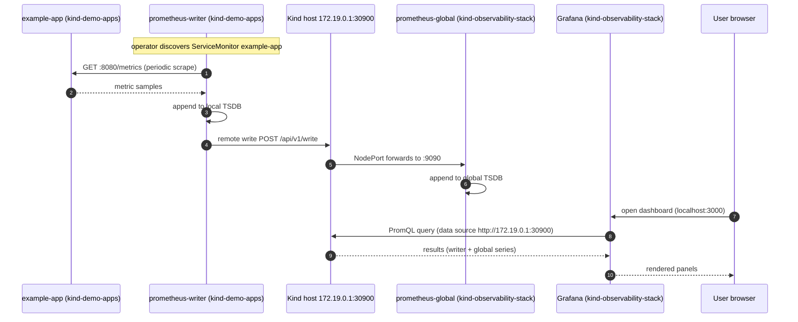
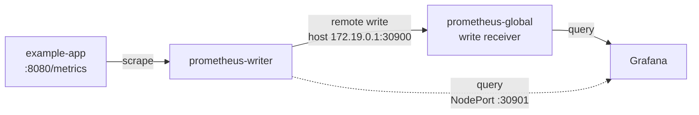

# Metrics Data Flow

How a sample travels from the instrumented app in the apps cluster to a Grafana dashboard
served from the observability cluster.

## Pipeline sequence

## Write path at a glance

Key configuration:

- `deploy/prometheus/writer/instance.yaml` sets `remoteWrite.url` to the global instance's
  NodePort endpoint on the Kind host (`http://172.19.0.1:30900/api/v1/write`).
- `deploy/prometheus/global/instance.yaml` sets `enableRemoteWriteReceiver: true` so the
  global instance accepts incoming remote-write traffic.
- `deploy/lgtm/values.yaml` provisions the Prometheus data source at
  `http://172.19.0.1:30900`, so Grafana queries the global instance, which holds both
  local and remotely written series.
