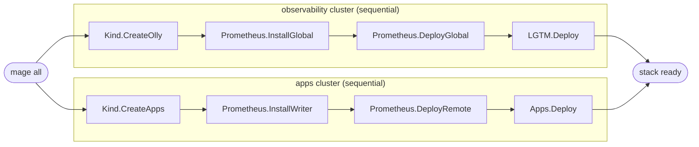
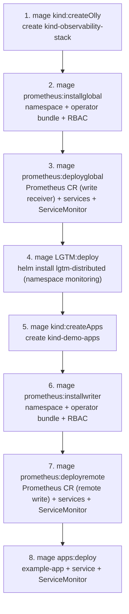
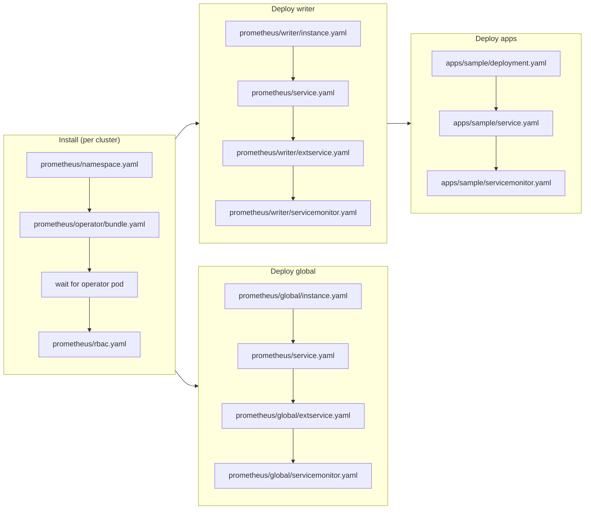
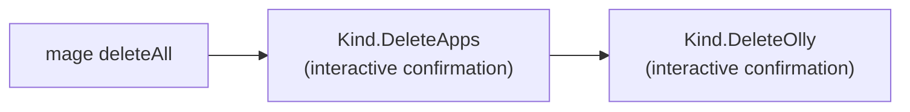

# Deployment Flow

All deployment steps are driven by Mage targets defined in `magefile.go`.

## `mage all` orchestration

Both clusters are created in parallel (`mg.Deps`); provisioning inside each cluster runs
sequentially (`mg.SerialDeps`).

## Manual step-by-step order

## What each install step applies

## Teardown

